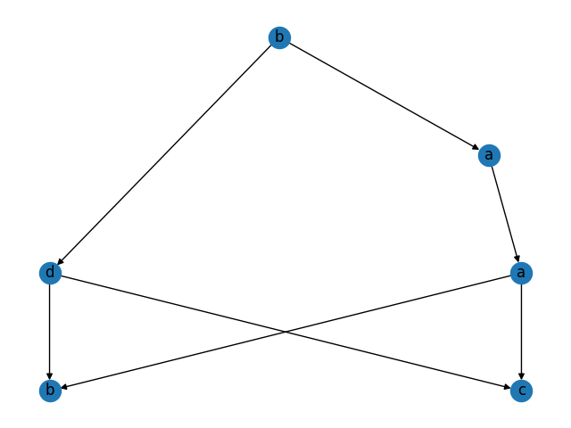
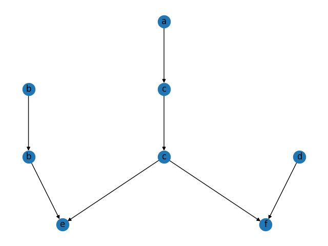

# Graf zależności

### Wstęp
Program zwraca graf zależności w postaci minimalnej dla danych wejściowych. Wykorzystuje algorytm śnieżkowy.

### Zależności
```sh
pip install networkx matplotlib pydot
```

### Wykorzystanie
```sh
python3 dependency_graph.py
```

### Wprowadzanie danych
Dane wczytywane są domyślnie z pliku `input.txt` który składa się z ciągu instrukcji w kolejnych linijkach i kończy słowem.
```
x=x+y
y=y+2z
x=3x+z
z=y-z
baadcb
```

### Wyjście
Program wypisuje na standardowym wyjściu kolejno, zbiór zależności, niezależności oraz postać normalna Foaty.
```
D = (a b) (a a) (d b) (b b) (c a) (c d) (a c) (d d) (c c) (b a) (d c) (b d) 

I = (b c) (a d) (c b) (d a) 

FNF = (b) (a d) (a) (b c) 
```

Wyrysowuje też graf zależności w postaci minimalnej.




### Pełen przykład

Wejście:
```
x=x+1
y=y+2z
x=3x+z
w=w+v
z=y-z
v=x+w
acdcfbbe
```

Wyjście:
```
D = (e e) (c e) (a a) (b b) (c a) (b e) (e c) (a c) (d d) (f a) (a f) (c c) (f d) (c f) (e b) (d f) (f c) 

I = (e a) (d e) (e d) (d b) (f e) (f b) (b a) (b d) (d a) (e f) (a b) (b c) (a e) (c b) (b f) (d c) (f f) (a d) (c d) 

FNF = (a b d) (b c) (c) (e f) 
```

